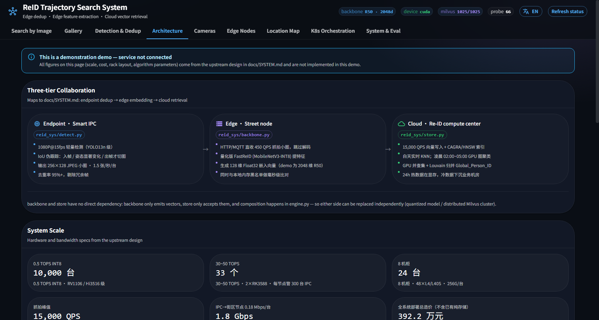

# System Design

!!! warning "Upstream design goals"
    This section summarizes the upstream design in `SYSTEM.md` at the repository root. Scale, cost,
    hardware and algorithm parameters are **design values**; this demo implements only a small part.

## Design principles

1. **Precise compute isolation, minimal sink-down**: detection & pseudo-tracking dedup at the endpoint,
   embedding at the edge, massive vector retrieval & offline clustering in the cloud, business logic
   and full storage in the business cloud.
2. **Absolute dedup, no-decode transport**: endpoint dedup drops 95% redundant frames, the edge takes
   JPEG thumbnails directly, the cloud is freed from RTSP/GB28181 hardware decoding.
3. **Physical separation of compute and business storage**: the AI compute center stays stateless/low-
   state and fast, isolated from the business/storage center.
4. **Hot/cold tiering and time-sharing**: 15,000 QPS real-time k-NN retrieval by day; GPUs switch to
   clustering during the idle overnight window.
5. **Containerization & unified K8s orchestration**: every compute unit is a standard Docker image,
   managed by K3s (edge) and Kubernetes (cloud).

## Three-tier collaboration

```
10,000 smart IPC  ──(B) 256×128 thumbnails──►  33 street edge nodes  ──(C) 128-d vectors──►  Re-ID compute center
   (detect・IoU pseudo-track・dedup)             (no-decode embedding・local watchlist)        (real-time retrieval・overnight cluster)
```

| Tier | Role | Hardware | Output |
| :---- | :---- | :---- | :---- |
| Endpoint IPC | 1080P@15fps detection; IoU pseudo-track crops only on enter/pose-change/exit | 0.5 TOPS INT8 NPU | 1.5 img/s・dedup 95%+ |
| Street edge | Takes thumbnails via HTTP/MQTT, embeds, matches local blacklist in ms | 30–50 TOPS (2×RK3588) | 128-d Float32 |
| Re-ID compute center | 15,000 QPS writes・CAGRA/HNSW retrieval, overnight GPU graph clustering | 24 servers / 8 racks・48×L4/L40S | Global_Person_ID |

## Dual data centers & 24-hour time-sharing

- **Business/storage center**: NVR video storage, business API, auth/logs, Mamba training, full cold archive.
- **Re-ID compute center**: keeps <24h un-merged-ID vectors resident in VRAM for fast retrieval.
- **Time-sharing**: 06:00–02:00 real-time retrieval; 02:00–05:00 triggers Flush → GPU Union-Find +
  Louvain to merge the day's 130M vectors into Global_Person_ID → pushes a ~1.5 GB index to the
  business center → erases data older than 24h.

## Mamba spatiotemporal pruning

When appearance is nearly identical (`S_visual = 0.92`) but the cross-camera transition is illogical
(`S_mamba = 0.02`), the final score collapses and the match is dropped as a false positive.

```
S_final = S_visual × σ(W · S_mamba + b)
```

Cold-start augmentation: geometric proximity masking (randomly mask 20–30% intermediate checkpoints),
OSM road-network pseudo-path generation, and Cam_Embedding + Continuous_Geo_Embedding with Gaussian
spatial perturbation.

## Millisecond watchlist (blacklist alerts)

Switches from "forward retrieval" to a reverse-match architecture: "in-memory resident targets +
data-stream penetration matching".

- Watchlist broadcast over a Pulsar/Kafka compacted topic, subscription updated within 50ms.
- The compute center keeps watchlist vectors resident in GPU VRAM and runs GEMM matching (<0.5 ms).
- The edge SIMD-matches a ~2.5 MB local blacklist; on a hit it pushes straight to the field terminal
  via MQTT (50–100 ms).
- A 5-minute sliding window keyed on `Watchlist_ID + Camera_ID` debounces; Tombstone messages revoke
  across the network in 10 ms.

## Smart Gateway routing

Hides the dual-data-center and vector-compute details from the upper image-search platform.

| Scenario | Route |
| :---- | :---- |
| Last 24h only | k-NN retrieval at the compute center (Milvus/CAGRA, ID-independent) |
| Older than 24h only | Query the business center's Global_Person_ID (SQL/ES) or the historical cold store |
| Spanning 24h | Query both concurrently → sort by timestamp, drop spatiotemporal noise → full trajectory |

!!! note "Mapping to this demo"
    `reid_sys/api.py` is a miniature of this gateway: it hides backbone / store details and runs as a
    single data center, single process (Mamba and cold-archive routing are not implemented).

## Cost (design values)

| Tier | Qty | Unit | Subtotal |
| :---- | :---- | :---- | :---- |
| Endpoint IPC upgrade | 10,000 | 150 CNY | 1.5M CNY |
| Street edge box | 33 | 4,000 CNY | 132K CNY |
| Compute GPU nodes | 12 | 120,000 CNY | 1.44M CNY |
| Compute storage nodes | 8 | 45,000 CNY | 360K CNY |
| Compute control nodes | 4 | 35,000 CNY | 140K CNY |
| Network / racks | 8 racks | — | 350K CNY |
| **Total** | | | **≈ 3.922M CNY** |

## Operations & DR

- Edge buffer: a 512 GB NVMe ring buffer caches 48h of vectors on network loss, auto-resumes after.
- Compute-center HA: multi-replica Milvus, C-class failover in 3s, B-class MinIO EC 6+2 (tolerates 2
  simultaneous node failures).
- Cloud-edge unified OTA: one-click canary rollout and zero-downtime rolling upgrades via K3s / K8s.

---


