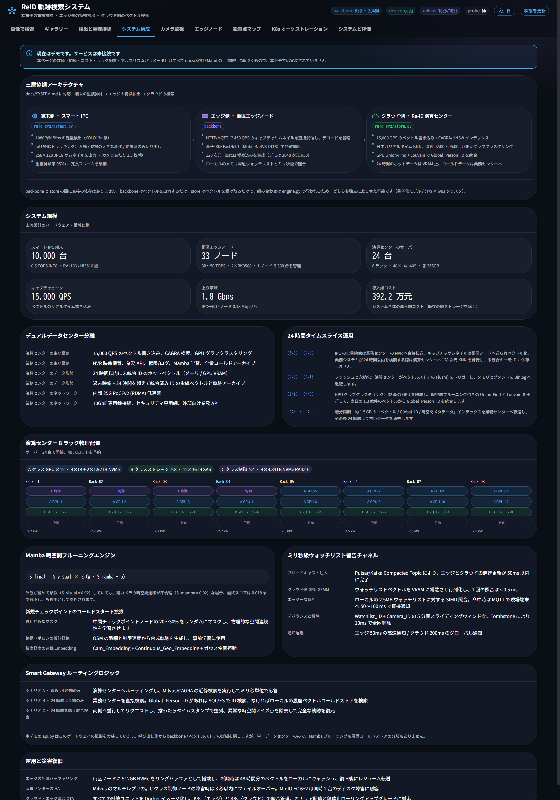

# システム設計

!!! warning "上流設計の目標"
    本節はリポジトリルートの `SYSTEM.md` の上流設計を要約したものです。規模・構築コスト・
    ハードウェア・アルゴリズムパラメータは**設計値**で、本 demo は一部のみを実装しています。

## 設計原則

1. **計算リソースの精密な切り離しと最小限の下位層への移譲**：検出と擬似トラッキングによる重複排除はカメラ側、
   特徴抽出はエッジ側、大量ベクトル検索とオフラインクラスタリングはクラウド側、業務ロジックと全量保存は
   業務クラウド側に置きます。
2. **絶対的な重複排除とデコードなしの転送**：カメラ側の擬似トラッキングで冗長フレームを 95% 除去し、
   エッジ側は JPEG の小画像を直接受け取って特徴を抽出、クラウド側は RTSP/GB28181 のハードウェアデコードの
   負荷から解放されます。
3. **計算と業務保存の物理分離**：AI 計算データセンターは状態をほとんど持たない高速計算に徹し、
   業務／保存データセンターと物理的に分離します。
4. **動静階層分離と時間帯分割**：日中は 15,000 QPS のリアルタイムベクトル近傍検索、深夜は GPU を
   クラスタリングに転用します。
5. **コンテナ化と Kubernetes による統一オーケストレーション**：すべての計算単位を標準的な Docker イメージに
   まとめ、エッジ側は K3s、クラウド側は Kubernetes で統一管理します。

## 三層協同

```
10,000 台のスマート IPC ──(B) 256×128 スナップショット小画像──► 33 の市街地エッジノード ──(C) 128 次元ベクトル──► Re-ID 計算データセンター
   （検出・IoU 擬似トラッキング・重複排除）                    （デコードなし特徴抽出・ローカル照合）        （リアルタイム検索・深夜クラスタ）
```

| 層 | 役割 | ハードウェア | 出力 |
| :---- | :---- | :---- | :---- |
| カメラ側 IPC | 1080P@15fps で検出、IoU 擬似トラッキングで出現・姿勢変化・退出時のみ切り出し | 0.5 TOPS INT8 NPU | 1.5 枚/秒・重複排除率 95% 以上 |
| 市街地エッジ | HTTP/MQTT でスナップショット小画像を直接受け取り特徴抽出、ローカルブラックリストとミリ秒で照合 | 30〜50 TOPS（2×RK3588） | 128 次元 Float32 |
| Re-ID 計算データセンター | 15,000 QPS の書き込み・CAGRA/HNSW 検索、深夜の GPU グラフクラスタリング | 24 台 / 8 ラック・48×L4/L40S | Global_Person_ID |

## 2 つのデータセンターと 24 時間の時間帯分割

- **業務／保存データセンター**：NVR への映像保存・業務 API・権限/ログ・Mamba の学習・全量アーカイブ。
- **Re-ID 計算データセンター**：24 時間以内の未統合 ID のベクトルを GPU メモリに常駐させて高速検索します。
- **時間帯分割運用**：06:00–02:00 はリアルタイム検索、02:00–05:00 に Flush → GPU による Union-Find +
  Louvain クラスタリングを実行して当日の 1.3 億件を Global_Person_ID に統合 → 約 1.5 GB の索引を業務
  データセンターへ増分同期 → 24 時間を超えた過去データを消去します。

## Mamba による時空制約プルーニング

外観が酷似していても（`S_visual = 0.92`）、カメラをまたぐ時空遷移が論理に合わなければ（`S_mamba = 0.02`）
誤検知として除外します。

```
S_final = S_visual × σ(W · S_mamba + b)
```

コールドスタート対策：幾何的近接マスキング（中間の検問ポイントを 20〜30% ランダムに mask）、
OSM 道路網からの疑似経路生成、Cam_Embedding + Continuous_Geo_Embedding にガウス空間摂動を重畳します。

## ミリ秒級のウォッチリスト（ブラックリストアラート）

「検索側から探す」方式をやめ、「メモリに常駐したターゲットへ、流れてきたデータをその場で照合する」
逆向きマッチングへ切り替えます。

- Pulsar/Kafka の Compacted Topic でウォッチリストを配信し、50 ms 以内に購読を更新します。
- 計算データセンターはウォッチリストのベクトルを GPU メモリに常駐させ、GEMM で照合します（1 回 < 0.5 ms）。
- エッジ側はローカルメモリのブラックリスト（約 2.5 MB）を SIMD で照合し、ヒット時はクラウドを経由せず
  MQTT で現場端末へ 50〜100 ms で直接通知します。
- `Watchlist_ID + Camera_ID` をキーにした 5 分のスライディングウィンドウでデバウンスし、Tombstone
  メッセージで 10 ms 以内に全網の指定を解除します。

## Smart Gateway のルーティング

上位の画像検索プラットフォームから、2 データセンター構成とベクトル計算の詳細を隠します。

| シナリオ | 経路 |
| :---- | :---- |
| 直近 24 時間のみ | 計算データセンターで Milvus/CAGRA 近傍検索（ID に依存しない） |
| 24 時間より前のみ | 業務データセンターの Global_Person_ID（SQL/ES）または履歴アーカイブ |
| 24 時間をまたぐ | 両側に並行リクエスト → タイムスタンプで整列・異常な時空ノイズを除外 → 完全な軌跡 |

!!! note "本 demo との対応"
    `reid_sys/api.py` はこのゲートウェイの縮小版です。backbone / store の詳細を隠し、
    単一データセンター・単一プロセスで動作します（Mamba と履歴アーカイブ的分岐は未実装）。

## 構築コスト（設計値・単位は人民元）

| 層 | 数量 | 単価 | 小計 |
| :---- | :---- | :---- | :---- |
| カメラ側 IPC のアップグレード | 10,000 台 | 150 | 150 万 |
| 市街地エッジボックス | 33 個 | 4,000 | 13.2 万 |
| 計算 GPU ノード | 12 台 | 120,000 | 144 万 |
| 計算ストレージノード | 8 台 | 45,000 | 36 万 |
| 計算制御ノード | 4 台 | 35,000 | 14 万 |
| ネットワーク機器／ラック | 8 ラック | — | 35 万 |
| **合計** | | | **約 392.2 万** |

## 運用と災害復旧

- 通信断時のバッファと自動転送再開：エッジノードは 512 GB の NVMe リングバッファで 48 時間分の
  ベクトルを保持し、通信復旧後に自動で転送を再開します。
- 計算データセンターの高可用性：Milvus を複数レプリカで構成し、C クラスノードは 3 秒で切替、
  B クラスの MinIO は EC 6+2 で 2 台の同時障害に耐えます。
- クラウド／エッジ共通の OTA：K3s / Kubernetes を使い、抽出モデルや Mamba エンジンの更新を
  カナリア配信とゼロダウンタイムのローリングアップグレードで適用できます。

---


