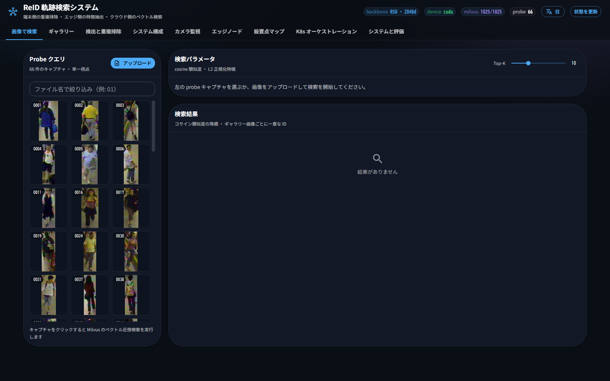
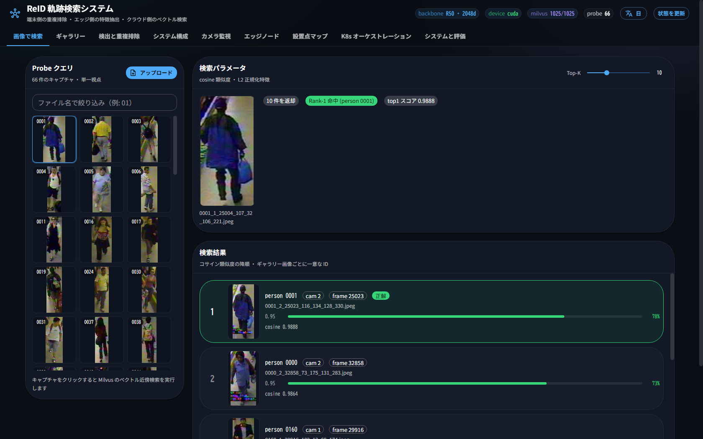
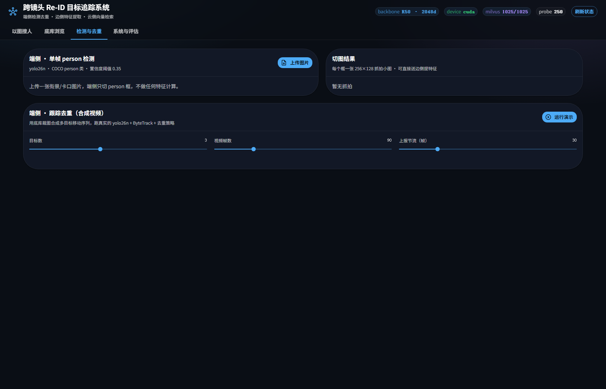
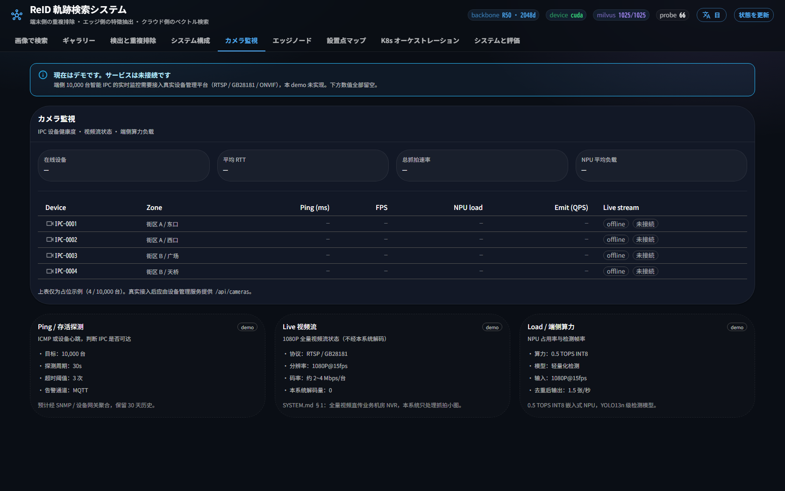
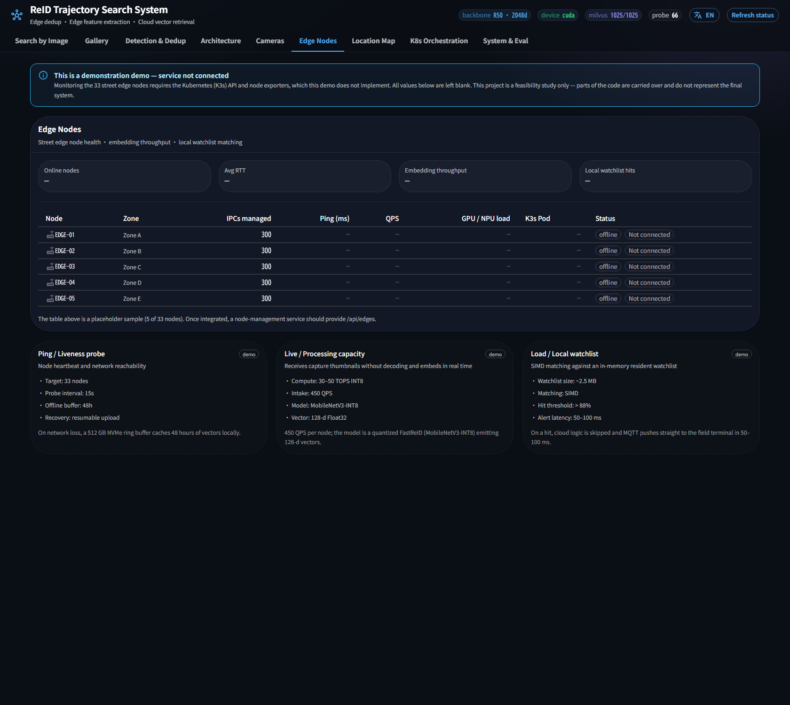
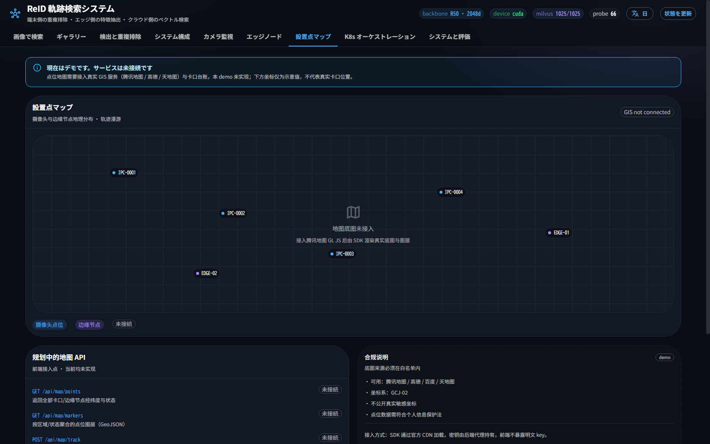
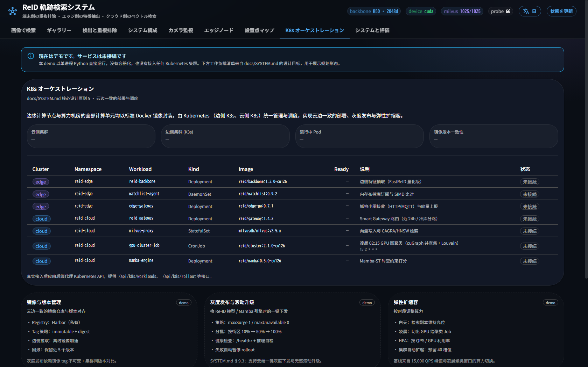

# 使い方

## 1. セットアップ

前提：[uv](https://docs.astral.sh/uv/) と CUDA 対応 GPU（無い場合は CPU に自動フォールバック）。

```bash
uv sync                 # 依存をインストール（torch cu126 を含む）
uv run reid-init        # data/*.zip を展開し、Milvus 索引を検証／補完構築
uv run python serve.py  # Smart Gateway を起動 → http://127.0.0.1:8000
```

`reid-init` の主なオプション：

| フラグ | 効果 |
| :---- | :---- |
| `--check` | 書き込まず検証のみ。欠けがあれば終了コード 1（CI 向け） |
| `--only data1` | 指定データセットのみ処理（繰り返し指定可） |
| `--force` | 既存索引を無視して全面再構築 |
| `--no-unzip` | 展開ステップをスキップ |

ブラウザで `http://127.0.0.1:8000` を開くとフロントエンドが、`/docs` を開くと API 仕様が参照できます。

## 2. フロントエンド画面（9 タブ）

ヘッダーに稼働状態チップ（`backbone R50 · 2048d` / `device` / `milvus 件数` / `probe 件数`）と
**データセット切替**・**言語切替（ja-JP / zh-TW / en-US）**・**状態更新**があります。

### 画像で検索（Search by Image）

左の Probe 一覧からスナップショット画像を選ぶか、画像をアップロードすると Milvus のベクトル近傍検索が走ります。
結果はコサイン類似度の降順で、各ギャラリー画像は一意の ID を持ちます。一致候補には「真値」バッジ、
類似度はスコアバーで表示されます。




### ギャラリー（Gallery）

ギャラリー画像をページング閲覧。検索候補の出典を確認するのに使います。

### 検出と重複排除（Detection & Dedup）

- **単一フレームの person 検出**：街景／検問ポイントの画像をアップロードすると、カメラ側相当で person の枠のみを切り出します（特徴計算は行いません）。
- **トラッキング重複排除（合成動画）**：ギャラリーの切り出し画像で複数ターゲットの移動系列を合成し、YOLO26n + ByteTrack + 重複排除を実行します。出現・姿勢変化・退出時のみ発火する Emit をタイムラインで確認できます。



### システム構成（Architecture）

`SYSTEM.md` の上流設計を可視化（三層協同・システム規模・2 データセンター・Mamba・ウォッチリスト・Smart Gateway のルーティング）。
下位タブと同様、**数値は設計値で本 demo は未実装**旨のバナーが常時表示されます。

### カメラ監視 / エッジノード / 設置点マップ

カメラ側 IPC・エッジノード・GIS 地点の監視画面。**デバイス管理基盤 / K3s / GIS は未接続**のため
指標は空、「未接続」バッジとプレースホルダーの台帳のみ表示します。





### K8s オーケストレーション

設計原則 #5 のコンテナ化／オーケストレーション像（edge=K3s / cloud=K8s のワークロード一覧、カナリア配信、弾性スケール）。
**実クラスタは未接続**のため `Ready`／集約指標は空です。



### システムと評価（System & Eval）

`/api/status` の稼働情報と `/api/eval` の検索評価（Rank-1 / mAP 系の指標）を表示します。

## 3. データセットの切替

ヘッダーのデータセットメニューで `data1` / `data2` を切り替えできます。切替は「現在ポインタ」の移動のみで、
対応 collection が未索引の場合は `reid-init` か `POST /api/index` で補完してください。

## 4. このドキュメントのビルド

```bash
uv run zensical serve   # ローカルプレビュー
uv run zensical build   # site/ に静的出力
```
